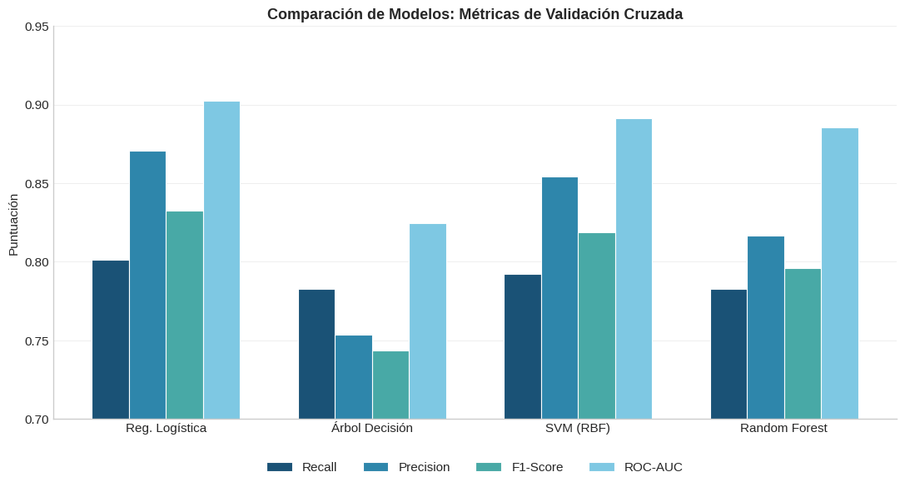
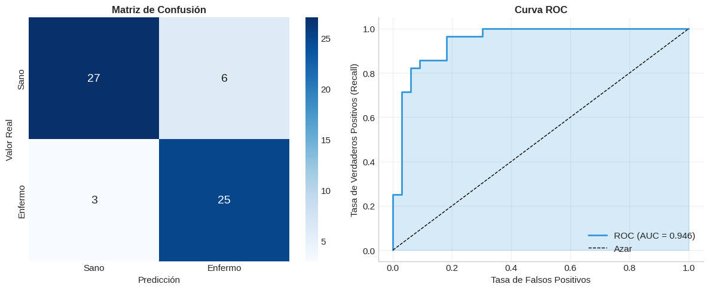

# Heart Disease ML Analysis

Supervised machine learning models for coronary artery disease prediction using the Cleveland Heart Disease dataset.

## Overview

Cardiovascular disease remains the leading cause of death worldwide. This project builds and compares four classification models to predict the presence of coronary artery disease from clinical features, prioritizing **recall** (sensitivity) to minimize missed diagnoses — a critical requirement in clinical screening.

The best model, **Logistic Regression**, achieves 89.3% recall and 94.6% ROC-AUC on the test set, correctly identifying 9 out of 10 patients with heart disease.

## Key Results

### Model Comparison



Grouped comparison of Recall, Precision, F1-Score, and ROC-AUC across all four models. Logistic Regression provides the best balance between sensitivity and overall performance.

### Final Model Evaluation



Logistic Regression on the held-out test set: confusion matrix (left) and ROC curve with AUC = 0.946 (right).

## Models

| Model | Recall (CV) | ROC-AUC (CV) | Recall (Test) | ROC-AUC (Test) |
|-------|-------------|---------------|---------------|-----------------|
| Logistic Regression | 80.2% | 90.2% | **89.3%** | **94.6%** |
| Decision Tree | 75.2% | 81.3% | 82.1% | 82.1% |
| SVM (RBF) | 78.5% | 89.5% | 85.7% | 93.4% |
| Random Forest | 77.2% | 90.0% | 85.7% | 93.8% |

All models trained with stratified 5-fold cross-validation and GridSearchCV for hyperparameter tuning.

## Methods

- **Dataset:** [UCI Heart Disease — Cleveland subset](https://archive.ics.uci.edu/dataset/45/heart+disease) (303 patients, 13 clinical features)
- **Preprocessing:** RobustScaler (numeric), OneHotEncoder (categorical), pipeline-based
- **Models:** Logistic Regression, Decision Tree, SVM (RBF), Random Forest
- **Tuning:** GridSearchCV with stratified 5-fold CV, optimized for recall
- **Evaluation:** Confusion matrix, ROC-AUC, learning curves, clinical interpretation

## Project Structure

```
├── heart_disease_prediction.ipynb    # Full analysis notebook
├── figures/
│   ├── model_comparison.png          # Model metrics comparison
│   ├── roc_curve.png                 # Final evaluation (confusion matrix + ROC)
│   └── learning_curves.png           # Learning curves for all models
├── requirements.txt
└── LICENSE
```

## Data Source

**UCI Machine Learning Repository** — [Heart Disease (Cleveland subset)](https://archive.ics.uci.edu/dataset/45/heart+disease).

> **Note:** This repository includes code and documentation only. Raw data are not redistributed and must be downloaded from the official source.

## Technologies

Python · scikit-learn · Logistic Regression · Decision Tree · SVM · Random Forest · GridSearchCV · matplotlib · seaborn

## How to Reproduce

```bash
pip install -r requirements.txt
jupyter notebook heart_disease_prediction.ipynb
```

Download the Heart Disease dataset from the [UCI ML Repository](https://archive.ics.uci.edu/dataset/45/heart+disease) and place it in the working directory before running the notebook.

> **Note:** The analysis notebook is written in Spanish.

## License

[MIT](LICENSE)
